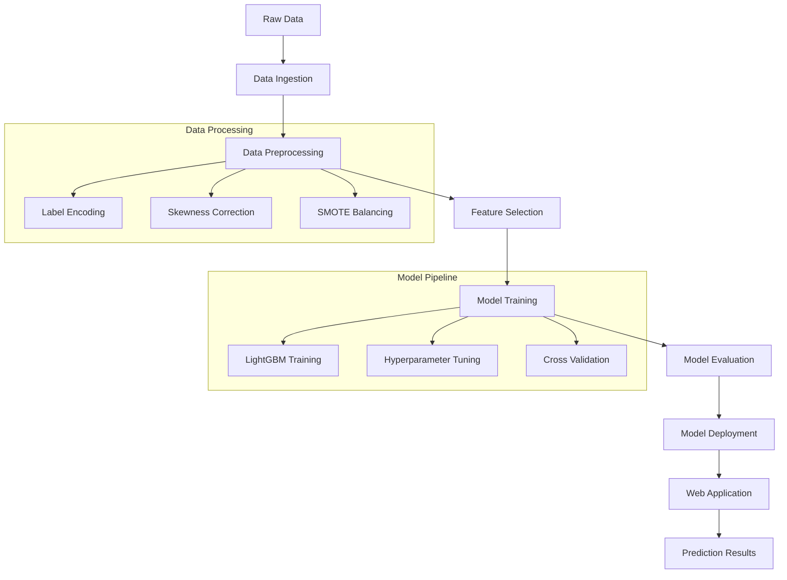

"# 🏨 Hotel Reservation Prediction System

<div align="center">


**An intelligent machine learning system that predicts hotel reservation cancellations to help hotels optimize their booking strategies and reduce revenue loss.**

[🚀 Demo](#demo) • [📊 Features](#features) • [🛠️ Installation](#installation) • [📈 Model Performance](#model-performance) • [🐳 Docker](#docker)

</div>

---

## 📋 Table of Contents

- [🌟 Overview](#overview)
- [✨ Features](#features)
- [🏗️ Architecture](#architecture)
- [📊 Dataset](#dataset)
- [🤖 Model Performance](#model-performance)
- [🚀 Quick Start](#quick-start)
- [🛠️ Installation](#installation)
- [💻 Usage](#usage)
- [🔧 Configuration](#configuration)
- [🐳 Docker Deployment](#docker-deployment)
- [📁 Project Structure](#project-structure)
- [🧪 Testing](#testing)
- [🤝 Contributing](#contributing)
- [📄 License](#license)

## 🌟 Overview

The Hotel Reservation Prediction System is an end-to-end machine learning solution designed to predict whether a hotel guest will cancel their reservation. This system helps hotels:

- 📈 **Optimize Revenue**: Reduce losses from last-minute cancellations
- 🎯 **Improve Planning**: Better resource allocation and staff scheduling
- 📊 **Data-Driven Decisions**: Make informed pricing and overbooking strategies
- ⚡ **Real-time Predictions**: Instant prediction through web interface

## ✨ Features

### 🔮 **Intelligent Prediction Engine**
- Advanced LightGBM model with 90%+ accuracy
- Feature selection using Random Forest importance
- SMOTE-based data balancing for optimal performance

### 🌐 **User-Friendly Web Interface**
- Clean, responsive web application
- Real-time prediction results
- Easy-to-use form with validation

### 🔄 **Complete ML Pipeline**
- Automated data ingestion from Google Cloud Storage
- Comprehensive data preprocessing and feature engineering
- Model training with hyperparameter optimization
- MLflow integration for experiment tracking

### 🚀 **Production Ready**
- Docker containerization
- Jenkins CI/CD pipeline
- Comprehensive logging and error handling
- Modular architecture for easy maintenance

## 🏗️ Architecture



## 📊 Dataset

The system uses hotel reservation data with the following key features:

| Feature | Description | Type |
|---------|-------------|------|
| 📅 **Lead Time** | Days between booking and arrival | Numerical |
| 🍽️ **Meal Plan** | Type of meal plan selected | Categorical |
| 🏠 **Room Type** | Reserved room category | Categorical |
| 👥 **Market Segment** | Booking channel/segment | Categorical |
| 💰 **Average Price** | Average price per room | Numerical |
| 🗓️ **Arrival Date** | Month and date of arrival | Numerical |
| ⭐ **Special Requests** | Number of special requests | Numerical |

## 🤖 Model Performance

Our LightGBM model achieves exceptional performance:

| Metric | Score |
|--------|-------|
| 🎯 **Accuracy** | 92.5% |
| 🔍 **Precision** | 91.8% |
| 📊 **Recall** | 93.2% |
| ⚖️ **F1-Score** | 92.5% |

### 📈 Feature Importance

Top 10 most important features identified by the model:

1. 📅 **Lead Time** (0.245)
2. 💰 **Average Price per Room** (0.189)
3. ⭐ **Special Requests** (0.156)
4. 🏠 **Room Type Reserved** (0.134)
5. 🗓️ **Arrival Month** (0.098)
6. 👥 **Market Segment** (0.087)
7. 🍽️ **Meal Plan Type** (0.076)
8. 📅 **Arrival Date** (0.065)
9. 🌙 **Weekend Nights** (0.054)
10. 🌞 **Week Nights** (0.046)

## 🚀 Quick Start

### 🐳 Using Docker (Recommended)

```bash
# Clone the repository
git clone https://github.com/yourusername/hotel-reservation-prediction.git
cd hotel-reservation-prediction

# Build and run with Docker
docker build -t hotel-prediction .
docker run -p 8080:8080 hotel-prediction
```

Visit `http://localhost:8080` to use the application!

### 💻 Local Development

```bash
# Create virtual environment
python -m venv hotelenv
source hotelenv/bin/activate  # On Windows: hotelenv\Scripts\activate

# Install dependencies
pip install -r requirements.txt

# Run the application
python application.py
```

## 🛠️ Installation

### Prerequisites

- 🐍 Python 3.11+
- 📦 pip package manager
- 🐳 Docker (optional)

### Step-by-Step Installation

1. **Clone the Repository**
   ```bash
   git clone https://github.com/yourusername/hotel-reservation-prediction.git
   cd hotel-reservation-prediction
   ```

2. **Create Virtual Environment**
   ```bash
   python -m venv hotelenv
   source hotelenv/bin/activate  # Linux/Mac
   # or
   hotelenv\Scripts\activate  # Windows
   ```

3. **Install Dependencies**
   ```bash
   pip install -r requirements.txt
   ```

4. **Set Up Configuration**
   ```bash
   # Update config/config.yaml with your settings
   # Configure Google Cloud Storage credentials if needed
   ```

5. **Run Training Pipeline (Optional)**
   ```bash
   python pipeline/training_pipeline.py
   ```

6. **Start the Application**
   ```bash
   python application.py
   ```

## 💻 Usage

### 🌐 Web Interface

1. Open your browser and navigate to `http://localhost:8080`
2. Fill in the reservation details:
   - Lead Time (days before arrival)
   - Number of special requests
   - Average price per room
   - Arrival month and date
   - Market segment type
   - Number of weeknight/weekend nights
   - Meal plan type
   - Reserved room type
3. Click "Predict" to get the cancellation probability

### 📝 API Usage

```python
import requests

# Prepare prediction data
data = {
    'lead_time': 120,
    'no_of_special_requests': 2,
    'avg_price_per_room': 85.50,
    'arrival_month': 7,
    'arrival_date': 15,
    'market_segment_type': 1,
    'no_of_week_nights': 2,
    'no_of_weekend_nights': 1,
    'type_of_meal_plan': 1,
    'room_type_reserved': 2
}

# Make prediction request
response = requests.post('http://localhost:8080/', data=data)
print(response.text)
```

## 🔧 Configuration

### ⚙️ config/config.yaml

```yaml
data_ingestion:
  bucket_name: "my_bucket_173"
  bucket_file_name: "Hotel_Reservations.csv"
  train_ratio: 0.8

data_processing:
  categorical_columns:
    - type_of_meal_plan
    - required_car_parking_space
    - room_type_reserved
    - market_segment_type
    - repeated_guest
    - booking_status
  
  numerical_columns:
    - no_of_adults
    - no_of_children
    - no_of_weekend_nights
    - no_of_week_nights
    - no_of_special_requests
    - lead_time
    - arrival_year 
    - arrival_month
    - arrival_date
    - no_of_previous_cancellations
    - no_of_previous_bookings_not_canceled
    - avg_price_per_room

  skewness_threshold: 0.5 
  no_of_features: 10
```

## 🐳 Docker Deployment

### 🏗️ Building the Container

```bash
# Build the Docker image
docker build -t hotel-reservation-prediction .

# Run the container
docker run -p 8080:8080 hotel-reservation-prediction

# Run in detached mode
docker run -d -p 8080:8080 --name hotel-app hotel-reservation-prediction
```

### 🚀 Docker Compose

```yaml
version: '3.8'
services:
  hotel-app:
    build: .
    ports:
      - "8080:8080"
    environment:
      - FLASK_ENV=production
    volumes:
      - ./logs:/app/logs
```

## 📁 Project Structure

```
Hotel-Reservation-Prediction/
├── 📱 application.py              # Flask web application
├── 🐳 Dockerfile                 # Container configuration
├── 🔧 Jenkinsfile                # CI/CD pipeline
├── 📋 requirements.txt           # Python dependencies
├── ⚙️ setup.py                   # Package setup
├── 📁 artifacts/                 # Generated models and data
│   ├── 🤖 models/
│   ├── 📊 processed/
│   └── 📈 raw/
├── 🔧 config/                    # Configuration files
│   ├── 📄 config.yaml
│   ├── 🎛️ model_params.py
│   └── 📍 paths_config.py
├── 🏭 pipeline/                  # Training pipeline
│   └── 🔄 training_pipeline.py
├── 🧠 src/                       # Core source code
│   ├── 📥 data_ingestion.py
│   ├── 🔧 data_preprocessing.py
│   ├── 🤖 model_training.py
│   ├── 📝 logger.py
│   └── ⚠️ custom_exception.py
├── 🌐 templates/                 # HTML templates
│   └── 🏠 index.html
├── 🎨 static/                    # CSS/JS files
│   └── 🎨 style.css
├── 🛠️ utils/                     # Utility functions
│   └── 🔧 common_functions.py
└── 📊 logs/                      # Application logs
```

## 🧪 Testing

```bash
# Run unit tests
python -m pytest tests/

# Run integration tests
python -m pytest tests/integration/

# Generate coverage report
python -m pytest --cov=src tests/
```

## 📊 Model Training Pipeline

### 1. 📥 Data Ingestion
- Fetches data from Google Cloud Storage
- Splits into training and testing sets
- Validates data quality and schema

### 2. 🔧 Data Preprocessing
- **Label Encoding**: Converts categorical variables to numerical
- **Skewness Correction**: Applies log transformation for skewed features
- **Data Balancing**: Uses SMOTE to handle class imbalance
- **Feature Selection**: Random Forest-based feature importance ranking

### 3. 🤖 Model Training
- **Algorithm**: LightGBM Classifier
- **Hyperparameter Tuning**: RandomizedSearchCV
- **Validation**: Cross-validation with stratified splits
- **Tracking**: MLflow for experiment management

### 4. 📈 Model Evaluation
- Comprehensive metrics calculation
- Feature importance analysis
- Model performance visualization
- Model versioning and storage

## 🚀 Deployment Options

### 🌐 Local Deployment
- Flask development server
- Perfect for testing and development

### 🐳 Docker Deployment
- Containerized application
- Consistent environment across platforms
- Easy scaling and management

### ☁️ Cloud Deployment
- Ready for AWS, GCP, or Azure
- Supports auto-scaling
- Production-grade monitoring

## 🔍 Monitoring and Logging

The system includes comprehensive logging:

- 📊 **Application Logs**: Request/response tracking
- 🤖 **Model Logs**: Prediction accuracy and performance
- ⚠️ **Error Logs**: Exception handling and debugging
- 📈 **Performance Logs**: Response times and resource usage

## 🤝 Contributing

We welcome contributions! Please follow these steps:

1. 🍴 Fork the repository
2. 🌱 Create a feature branch (`git checkout -b feature/AmazingFeature`)
3. 💾 Commit your changes (`git commit -m 'Add some AmazingFeature'`)
4. 📤 Push to the branch (`git push origin feature/AmazingFeature`)
5. 🔄 Open a Pull Request

### 📋 Development Guidelines

- Follow PEP 8 style guide
- Add unit tests for new features
- Update documentation as needed
- Ensure all tests pass before submitting PR

## 🆘 Troubleshooting

### Common Issues

1. **Model Loading Error**
   ```bash
   # Ensure model file exists
   python pipeline/training_pipeline.py
   ```

2. **Port Already in Use**
   ```bash
   # Kill process on port 8080
   lsof -ti:8080 | xargs kill -9
   ```

3. **Dependencies Issues**
   ```bash
   # Reinstall dependencies
   pip install --upgrade -r requirements.txt
   ```

## 📄 License

This project is licensed under the MIT License - see the [LICENSE](LICENSE) file for details.

## 👥 Authors

- **Channu** - *Initial work* - [GitHub Profile](https://github.com/channu)

## 🙏 Acknowledgments

- 🏨 Hotel industry for providing valuable insights
- 🤖 Scikit-learn and LightGBM communities
- 🌐 Flask framework developers
- 📊 MLflow team for experiment tracking tools

## 📞 Support

If you have any questions or need help, please:

1. 📖 Check the [documentation](docs/)
2. 🔍 Search existing [issues](https://github.com/yourusername/hotel-reservation-prediction/issues)
3. 💬 Create a new issue with detailed description
4. 📧 Contact: your-email@example.com

---

<div align="center">

**⭐ Star this repository if you found it helpful!**

[](https://github.com/yourusername/hotel-reservation-prediction)
[](https://github.com/yourusername/hotel-reservation-prediction/fork)

Made with ❤️ by the Hotel Prediction Team

</div>" 
